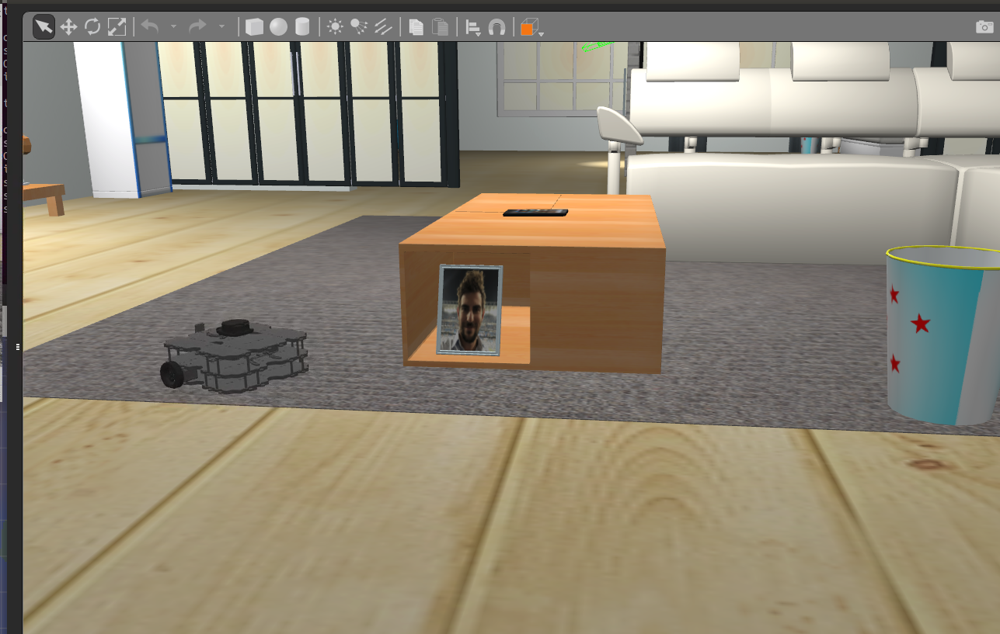

# AWS RoboMaker Sample Application - Navigation and Person Detection

This application demonstrates the use of Amazon Rekognition to recognize people's faces
and Amazon Polly to synthesize speech.


_RoboMaker sample applications include third-party software licensed under open-source licenses and is provided for demonstration purposes only. Incorporation or use of RoboMaker sample applications in connection with your production workloads or a commercial products or devices may affect your legal rights or obligations under the applicable open-source licenses. Source code information can be found [here](https://s3.console.aws.amazon.com/s3/buckets/robomaker-applications-us-east-1-72fc243f9355/person-detection/?region=us-east-1)._




## Usage

## Requirements

- [ROS Kinetic](http://wiki.ros.org/kinetic/Installation/Ubuntu) / [ROS Melodic](http://wiki.ros.org/melodic/Installation/Ubuntu) - Other versions may work, however they have not been tested
- [Colcon](https://colcon.readthedocs.io/en/released/user/installation.html) - Used for building and bundling the application.

## AWS Account Setup

### Resources
This sample application uses Amazon Kinesis and Amazon Rekognition to recognize faces. See [here](#architecture-details) for details.
The easiest method is to reuse the resources create by the AWS RoboMaker sample application. To do that follow these steps:
1. Sign in to the AWS RoboMaker console at https://us-west-2.console.aws.amazon.com/robomaker/home/.
2. In the AWS RoboMaker console, expand Resources on the left and then select Sample applications.
3. In the **Try RoboMaker sample applications** page, select **Navigation and person recognition** and then select Launch.
4. There will be a banner at the top of the page listing the number of resources that have been created. When all of the resources have been created
it will open the **simulation job detail** page. At this point cancel the simulation job. This will not delete any of the resources.
5. Open the AWS CloudFormation console at https://console.aws.amazon.com/cloudformation/ and find the stack with AWSRoboMakerPersonDetection in the name.
6. Expand the **Parameters** tab and find the **LaunchId** Key.
7. In the runtime environment for the robot application set the `LAUNCH_ID` environmental variable to the **LaunchId** value from CloudFormation.
   In AWS RoboMaker the environmental variable can be set as an option when running a simulation job.
   In a Linux environment this can be accomplisehd with `export LAUNCH_ID=<value>`
8. When the robot application is run the launch files will use the `LAUNCH_ID` to connect to the correct Kinesis data stream and Kinesis video stream.

When setting up resources using the above method new faces can be added to Rekognition with the following steps:
1. Open the AWS CloudFormation console at https://console.aws.amazon.com/cloudformation/ and find the stack with AWSRoboMakerPersonDetection in the name.
2. Expand the **Resources** tab and find the Physical ID of the Amazon S3 bucket with the Logical ID **BundlesBucket**.
3. Copy the image into the **photos** folder of the bucket with the following command
```bash
aws s3 cp path/to/image s3://<physical_id>/photos/persons_name.png
```

If you'd like more detailed control over the resources follow the instructions here: https://docs.aws.amazon.com/rekognition/latest/dg/recognize-faces-in-a-video-stream.html.
Make sure that the names of the Kinesis video stream and data stream match those in src/person_detection_robot/launch/kinesis.launch.

### Permissions

To publish to Amazon CloudWatch Metrics and Logs the IAM user configured in the environment in which the node is running
will need the following permissions:
 ```
   logs:PutLogEvents
   logs:DescribeLogStreams
   logs:CreateLogStream
   logs:CreateLogGroup
```
For more information about the CloudWatch Metrics node see here: https://github.com/aws-robotics/cloudwatchmetrics-ros1

For more information about the CloudWatch Logs node see here: https://github.com/aws-robotics/cloudwatchlogs-ros1


To use the Kinesis node you will need an IAM user with the following permissions:
 ```
  kinesisvideo:CreateStream
  kinesisvideo:TagStream
  kinesisvideo:DescribeStream
  kinesisvideo:GetDataEndpoint
  kinesisvideo:PutMedia
  kinesis:ListShards
  kinesis:GetShardIterator
  kinesis:GetRecords
  ```
For more information on the Amazon Kinesis node see here: https://github.com/aws-robotics/kinesisvideo-ros1

To use the Polly node you will need an IAM user with the following permissions:
```
  polly:SynthesizeSpeech
```
For more information on the Amazon Polly node see here https://github.com/aws-robotics/tts-ros1

Information about attaching permissions to an IAM user can be found here: https://docs.aws.amazon.com/IAM/latest/UserGuide/id_users_change-permissions.html

Information about configuring AWS credentials can be found here: https://docs-aws.amazon.com/cli/latest/userguide/cli-chap-getting-started.html#cli-multiple-profiles


## Build

### Pre-build commands

```bash
sudo apt-get update
rosdep update
```

### Robot

```bash
cd robot_ws
rosws update
rosdep install --from-paths src --ignore-src -r -y
colcon build
```

### Simulation

```
cd simulation_ws
rosws update
rosdep install --from-paths src --ignore-src -r -y
colcon build
```

## Run

Launch the application with the following commands:

- *Running Robot Application on a Robot*

    Once the bundle has been created, it can be deployed using RoboMaker. For information about deploying using RoboMaker, see [this documentation](https://docs.aws.amazon.com/robomaker/latest/dg/gs-deploy.html). You can follow those instructions
    to cross-compile the sample application for the ARMHF architecture supported by the Raspberry PI, using a RoboMaker
    Development environment.

    You must also complete the Raspberry Pi camera setup for the TurtleBot WafflePi, outlined
    [here](http://emanual.robotis.com/docs/en/platform/turtlebot3/appendix_raspi_cam/#raspberry-pi-camera).

    You must run the following command before running the Robot Application on the robot.
    ```bash
    sudo chmod 777 /dev/video0
    ```

    You may also upload and run the bundle manually. Once the bundle has been manually uploaded to the target TurtleBot WafflePi, ssh into the TurtleBot and run

    ```bash
    tar xvf robot_ws_armhf_bundle.tar
    mkdir dependencies && tar xvzf dependencies.tar.gz -C dependencies
    mkdir workspace && tar xvzf workspace.tar.gz -C workspace
    export LAUNCH_ID=YOUR_LAUNCH_ID
    BUNDLE_CURRENT_PREFIX=$(pwd)/dependencies source $(pwd)/dependencies/setup.sh
    BUNDLE_CURRENT_PREFIX=$(pwd)/workspace source $(pwd)/workspace/setup.sh
    roslaunch person_detection_robot deploy_person_detection.launch
    ```

    See the [colcon-bundle documentation](https://github.com/colcon/colcon-bundle#bundle-usage) for more details.

    Finally, note the `width` and `height` parameters for the node `raspicam_node` on `deploy_person_detection.launch` might require
    some adjustment depending on the resolution of the specific robot camera.

- *Running Robot Application Elsewhere*
    ```bash
    source robot_ws/install/local_setup.sh
    roslaunch person_detection_robot person_detection.launch
    ```

- *Running Simulation Application*
    ```bash
    source simulation_ws/install/local_setup.sh
    TURTLEBOT3_MODEL=waffle_pi roslaunch person_detection_simulation [command]
    ```
    There are two simulation launch commands:
    - `small_house.launch` - A world with a kitchen, bedroom and living areas. The Turtlebot3 spawned is stationary waiting commands.
    - `small_house_turtlebot_navigation.launch` - A small house with TB3 autonomously navigating to goal points on a route.

## Using this sample with RoboMaker

You first need to install colcon-ros-bundle. Python 3.5 or above is required.

```bash
pip3 install colcon-ros-bundle
```

After colcon-ros-bundle is installed you need to build your robot or simulation, then you can bundle with:

```bash
# Bundling Robot Application
cd robot_ws
source install/local_setup.sh
colcon bundle

# Bundling Simulation Application
cd simulation_ws
source install/local_setup.sh
colcon bundle
```

This produces the artifacts `robot_ws/bundle/output.tar` and `simulation_ws/bundle/output.tar` respectively.

You'll need to upload these to an s3 bucket, then you can use these files to
[create a robot application](https://docs.aws.amazon.com/robomaker/latest/dg/create-robot-application.html),
[create a simulation application](https://docs.aws.amazon.com/robomaker/latest/dg/create-simulation-application.html),
and [create a simulation job](https://docs.aws.amazon.com/robomaker/latest/dg/create-simulation-job.html) in RoboMaker.

## Architecture Details


## AWS ROS Packages used by this Sample

- RoboMakerUtils-Common
- RobomakerUtils-ROS1
- CloudWatch-Common
- CloudWatchLogs-ROS1
- CloudWatchMetrics-ROS1
- HealthMetricsCollector-ROS1
- KinesisVideo-Common
- KinesisVideo-ROS1
- KinesisVideoEncoder-Common
- KinesisVideoEncoder-ROS1
- MonitoringMessages-ROS1
- TTS-ROS1


## License

MIT-0 - See LICENSE.txt for further information

## How to Contribute

Create issues and pull requests against this Repository on Github
